---
## Front matter
title: "Лабораторная работа №7: Эффективность рекламы"
subtitle: "*дисциплина: Математическое моделирование*"
author: "Голова Варвара Алексеевна"
date: 2021, 26 March

## Formatting
mainfont: PT Serif
romanfont: PT Serif
sansfont: PT Sans
monofont: PT Mono
toc: false
slide_level: 2
theme: metropolis
header-includes:
 - \metroset{progressbar=frametitle,sectionpage=progressbar,numbering=fraction}
 - '\makeatletter'
 - '\beamer@ignorenonframefalse'
 - '\makeatother'
aspectratio: 43
section-titles: true

---

# Цель работы

Ознакомиться с моделью эффективного распространения рекламы и построить графики по этой модели.

# Задание

Построить график распространения рекламы, математическая модель которой описывается следующим уравнением:

1. $\frac{dn}{dt}=(0.48+0.000081n(t))(N-n(t))$
2. $\frac{dn}{dt}=(0.000049+0.82n(t))(N-n(t))$
3. $\frac{dn}{dt}=(0.6t+0.3sin(3t)n(t))(N-n(t))$

При этом объем аудитории $N=1655$, в начальный момент о товаре знает $18$ человек.

# Выполнение лабораторной работы

## Библиотеки

Подключаю все необходимые библиотеки(рис. -@fig:001).

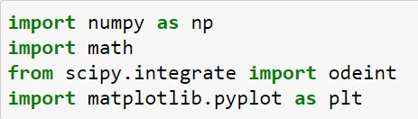{ #fig:001 width=70% }

## Значения

Ввод значений из своего варианта (28 вариант)(рис. -@fig:002).

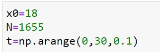{ #fig:002 width=70% }

## Случай 1

Функция, отвечающая за платную рекламу (рис. -@fig:003).

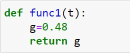{ #fig:003 width=70% }

## Случай 1

Функция, отвечающая за "сарафанное радио" (рис. -@fig:004).

{ #fig:004 width=70% }

## Случай 1

Решение 1 (рис. -@fig:005).

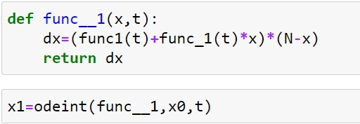{ #fig:005 width=70% }

## Вывод графика для случая 1

График распространения рекламы (рис. -@fig:006).

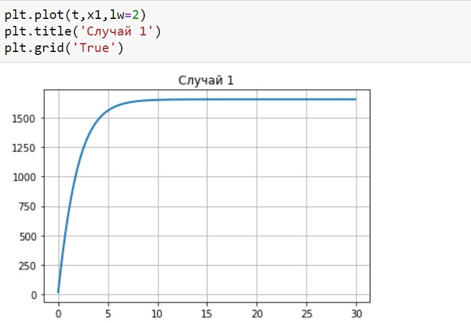{ #fig:006 width=70% }

## Случай 2

Функция, отвечающая за платную рекламу (рис. -@fig:007).

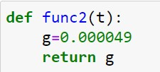{ #fig:007 width=70% }

## Случай 2

Функция, отвечающая за "сарафанное радио" (рис. -@fig:008).

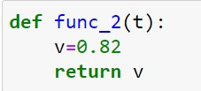{ #fig:008 width=70% }

## Случай 2

Решение 2 (рис. -@fig:009).

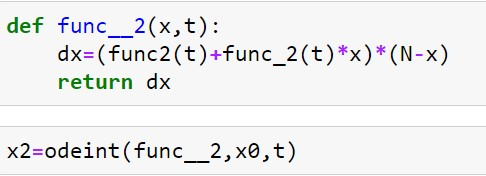{ #fig:009 width=70% }

## Вывод графика для случая 2

График распространения рекламы (рис. -@fig:010).

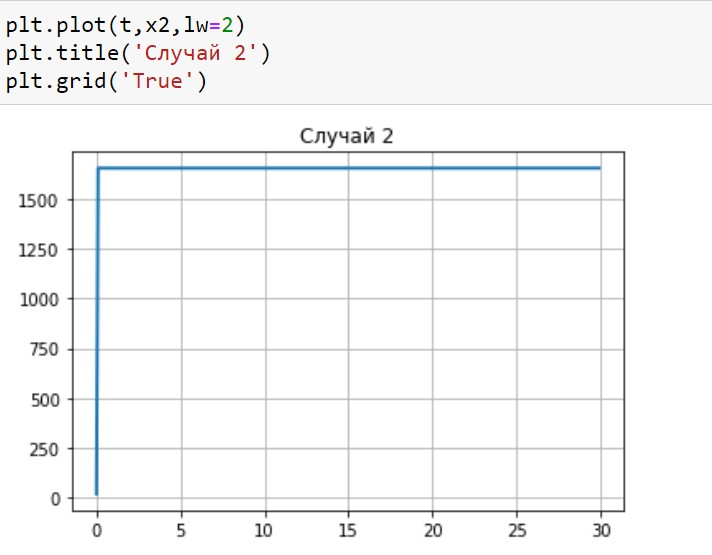{ #fig:010 width=70% }

## Случай 3

Функция, отвечающая за платную рекламу (рис. -@fig:011).

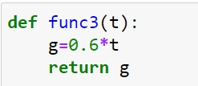{ #fig:011 width=70% }

## Случай 3

Функция, отвечающая за "сарафанное радио" (рис. -@fig:012).

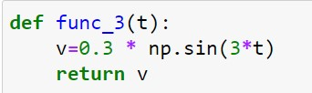{ #fig:012 width=70% }

## Случай 3

Решение 3 (рис. -@fig:013).

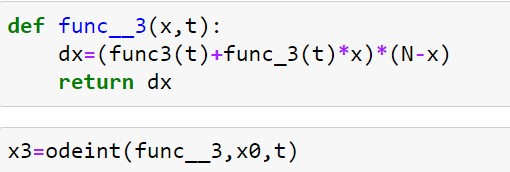{ #fig:013 width=70% }

## Вывод графика для случая 3

График распространения рекламы (рис. -@fig:014).

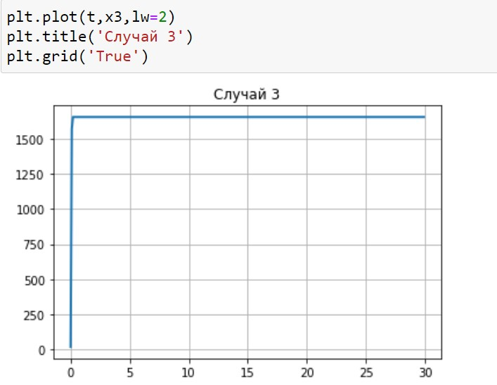{ #fig:014 width=70% }

## Вывод графика для случая 3

График с интервалом $(0,5)$ (рис. -@fig:015).

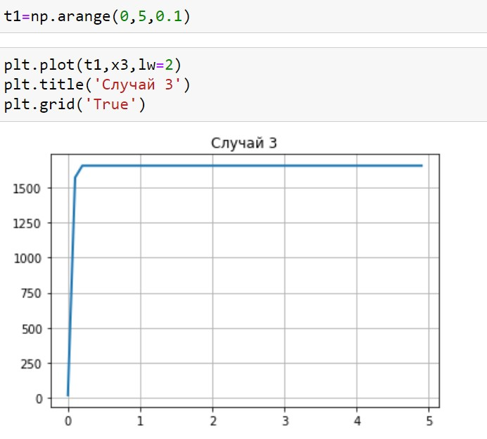{ #fig:015 width=70% }

## Максимальная скорость распространения рекламы (для случая 2)

Интервал времени для определения точки (рис. -@fig:016).

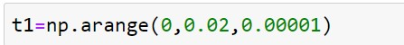{ #fig:016 width=70% }

## Максимальная скорость распространения рекламы (для случая 2)

Момент времени, в котором скорость распространения рекламы будет иметь максимальное значение (рис. -@fig:017).

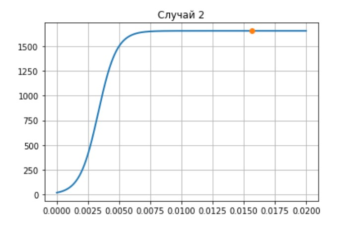{ #fig:017 width=70% }

# Выводы

Я ознакомилась с моделью эффективного распространения рекламы и построила графики по этой модели.
