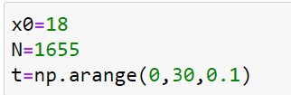
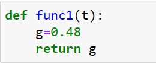
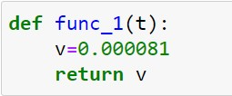
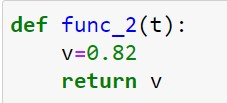
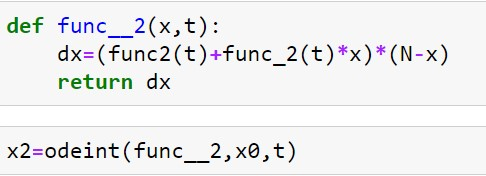
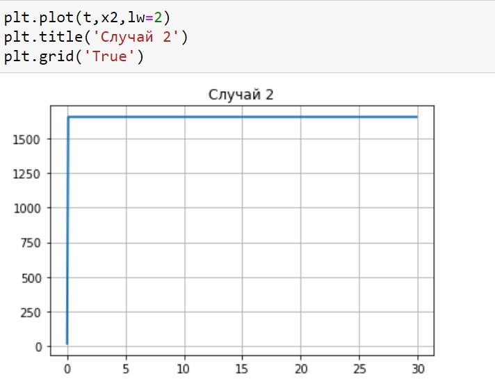
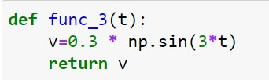
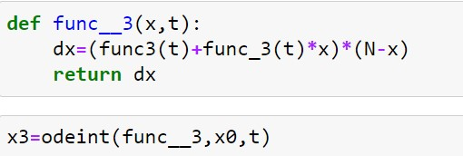
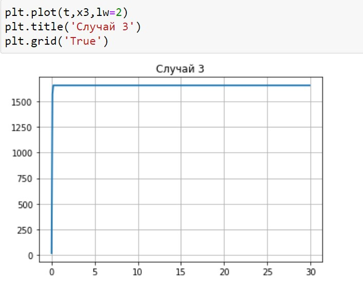
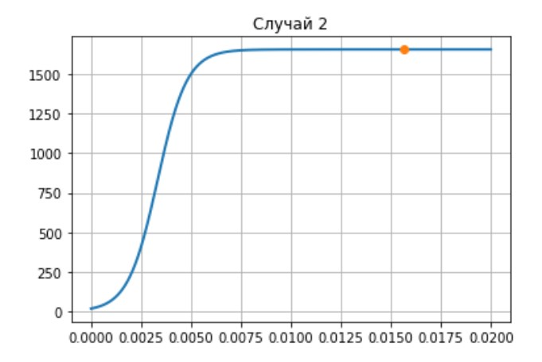

---
# Front matter
title: "Отчет по лабораторной работе №7"
subtitle: "Эффективность рекламы"
author: "Голова Варвара Алексеевна"
group: "НФИбд-03-18"
ID: "1032182507"

# Formatting
toc-title: "Содержание"
toc: true # Table of contents
toc_depth: 2
lof: true # List of figures
fontsize: 12pt
linestretch: 1.5
papersize: a4paper
documentclass: scrreprt
polyglossia-lang: russian
polyglossia-otherlangs: english
mainfont: PT Serif
romanfont: PT Serif
sansfont: PT Sans
monofont: PT Mono
mainfontoptions: Ligatures=TeX
romanfontoptions: Ligatures=TeX
sansfontoptions: Ligatures=TeX,Scale=MatchLowercase
monofontoptions: Scale=MatchLowercase
indent: true
pdf-engine: lualatex
header-includes:
  - \linepenalty=10 # the penalty added to the badness of each line within a paragraph (no associated penalty node) Increasing the value makes tex try to have fewer lines in the paragraph.
  - \interlinepenalty=0 # value of the penalty (node) added after each line of a paragraph.
  - \hyphenpenalty=50 # the penalty for line breaking at an automatically inserted hyphen
  - \exhyphenpenalty=50 # the penalty for line breaking at an explicit hyphen
  - \binoppenalty=700 # the penalty for breaking a line at a binary operator
  - \relpenalty=500 # the penalty for breaking a line at a relation
  - \clubpenalty=150 # extra penalty for breaking after first line of a paragraph
  - \widowpenalty=150 # extra penalty for breaking before last line of a paragraph
  - \displaywidowpenalty=50 # extra penalty for breaking before last line before a display math
  - \brokenpenalty=100 # extra penalty for page breaking after a hyphenated line
  - \predisplaypenalty=10000 # penalty for breaking before a display
  - \postdisplaypenalty=0 # penalty for breaking after a display
  - \floatingpenalty = 20000 # penalty for splitting an insertion (can only be split footnote in standard LaTeX)
  - \raggedbottom # or \flushbottom
  - \usepackage{float} # keep figures where there are in the text
  - \floatplacement{figure}{H} # keep figures where there are in the text
---

# Цель работы

Ознакомиться с моделью эффективного распространения рекламы и построить графики по этой модели.

# Задание

Вариант 28

Построить график распространения рекламы, математическая модель которой описывается следующим уравнением:

1. $\frac{dn}{dt}=(0.48+0.000081n(t))(N-n(t))$
2. $\frac{dn}{dt}=(0.000049+0.82n(t))(N-n(t))$
3. $\frac{dn}{dt}=(0.6t+0.3sin(3t)n(t))(N-n(t))$

При этом объем аудитории $N=1655$, в начальный момент о товаре знает $18$ человек.

#Теоретическая справка

Организуется рекламная кампания нового товара или услуги. Необходимо, чтобы прибыль будущих продаж с избытком покрывала издержки на рекламу. Вначале расходы могут превышать прибыль, поскольку лишь малая часть
потенциальных покупателей будет информирована о новинке. Затем, при увеличении числа продаж, возрастает и прибыль, и, наконец, наступит момент, когда рынок насытиться, и рекламировать товар станет бесполезным.

Предположим, что торговыми учреждениями реализуется некоторая продукция, о которой в момент времени $t$
из числа потенциальных покупателей $N$ знает лишь $n$
покупателей. Для ускорения сбыта продукции запускается
реклама по радио, телевидению и других средств массовой информации. После запуска рекламной кампании информация о продукции начнет распространяться среди
потенциальных покупателей путем общения друг с другом. Таким образом, после запуска рекламных объявлений скорость изменения числа знающих о продукции людей пропорциональна как числу знающих о товаре покупателей, так и числу покупателей о нем не знающих.

Модель рекламной кампании описывается следующими величинами. Считаем, что $\frac{dn}{dt}$ - скорость изменения со временем числа потребителей, узнавших о товаре и готовых его купить, $t$ - время, прошедшее с начала рекламной кампании, $n(t)$ - число уже информированных клиентов. Эта величина пропорциональна числу покупателей, еще не знающих о нем, это описывается
следующим образом: $\alpha_1(t)(N-n(t))$, где $N$ - общее число потенциальных платежеспособных покупателей, $\alpha_1(t)>0$ - характеризует интенсивность рекламной кампании (зависит от затрат на рекламу в данный момент времени). Помимо этого, узнавшие о товаре потребители также распространяют полученную информацию среди потенциальных покупателей, не знающих о нем (в этом случае работает т.н. сарафанное радио). Этот вклад в рекламу описывается величиной $\alpha_2(t)n(t)(N-n(t))$, эта величина увеличивается с увеличением потребителей
узнавших о товаре. Математическая модель распространения рекламы описывается уравнением:
$$\frac{dn}{dt}=(\alpha_1(t)+\alpha_2(t)n(t))(N-n(t))$$
При $\alpha_1(t)\gg\alpha_2(t)$ получается модель типа модели Мальтуса, решение которой имеет вид (рис. -@fig:001).

{ #fig:001 width=70% }

В обратном случае, при $\alpha_1(t)\ll\alpha_2(t)$
получаем уравнение логистической кривой (рис. -@fig:002).

{ #fig:002 width=70% }

# Выполнение лабораторной работы

## Библиотеки

Подключаю все необходимые библиотеки(рис. -@fig:003).

{ #fig:003 width=70% }

## Значения

Ввод значений из своего варианта (28 вариант)(рис. -@fig:004).

{ #fig:004 width=70% }

## Случай 1

Функция, отвечающая за платную рекламу (рис. -@fig:005).

{ #fig:005 width=70% }

Функция, отвечающая за "сарафанное радио" (рис. -@fig:006).

{ #fig:006 width=70% }

Решение 1 (рис. -@fig:007).

{ #fig:007 width=70% }

## Вывод графика для случая 1

График распространения рекламы (рис. -@fig:008).

{ #fig:008 width=70% }

## Случай 2

Функция, отвечающая за платную рекламу (рис. -@fig:009).

{ #fig:009 width=70% }

Функция, отвечающая за "сарафанное радио" (рис. -@fig:010).

{ #fig:010 width=70% }

Решение 2 (рис. -@fig:011).

{ #fig:011 width=70% }

## Вывод графика для случая 2

График распространения рекламы (рис. -@fig:012).

{ #fig:012 width=70% }

## Случай 3

Функция, отвечающая за платную рекламу (рис. -@fig:013).

{ #fig:013 width=70% }

Функция, отвечающая за "сарафанное радио" (рис. -@fig:014).

{ #fig:014 width=70% }

Решение 3 (рис. -@fig:015).

{ #fig:015 width=70% }

## Вывод графика для случая 3

График распространения рекламы (рис. -@fig:016).

{ #fig:016 width=70% }

График с интервалом $(0,5)$ (рис. -@fig:017).

{ #fig:017 width=70% }

## Максимальная скорость распространения рекламы (для случая 2)

Интервал времени для определения точки (рис. -@fig:018).

{ #fig:018 width=70% }

Момент времени, в котором скорость распространения рекламы будет иметь максимальное значение (рис. -@fig:019).

{ #fig:019 width=70% }

# Выводы

Я ознакомилась с моделью эффективного распространения рекламы и построила графики по этой модели.
